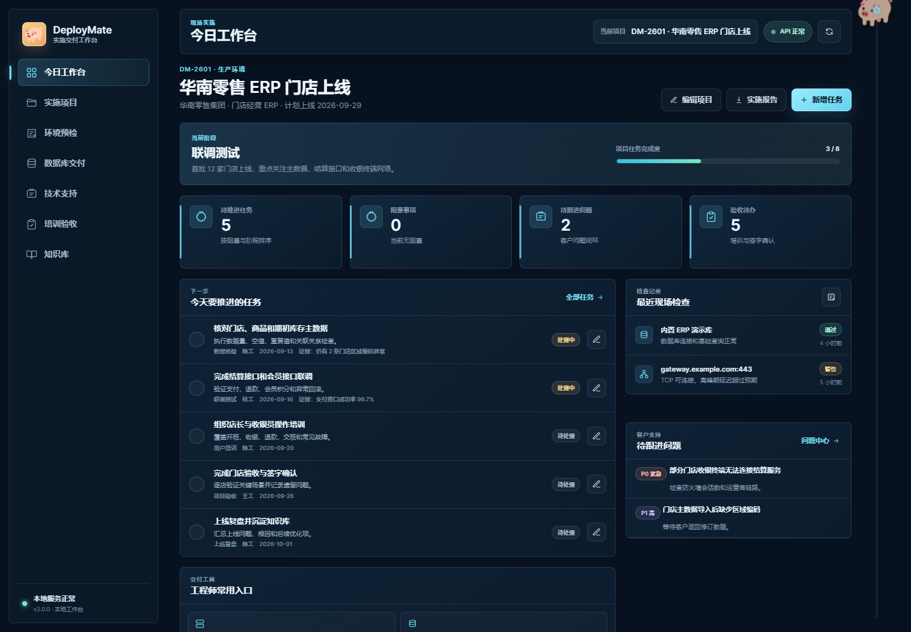
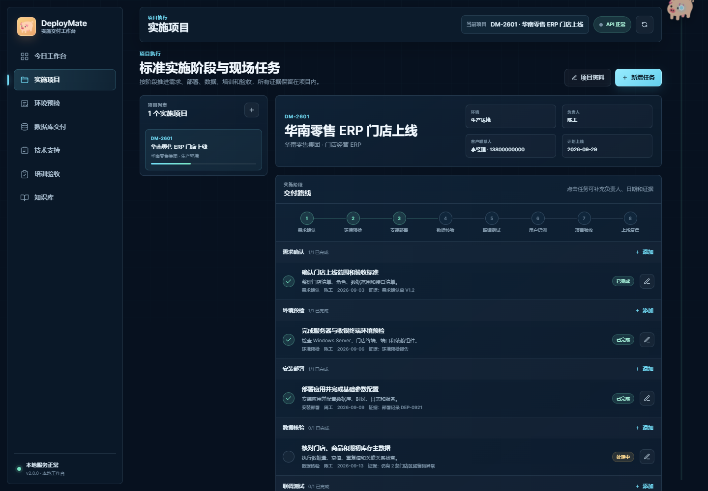
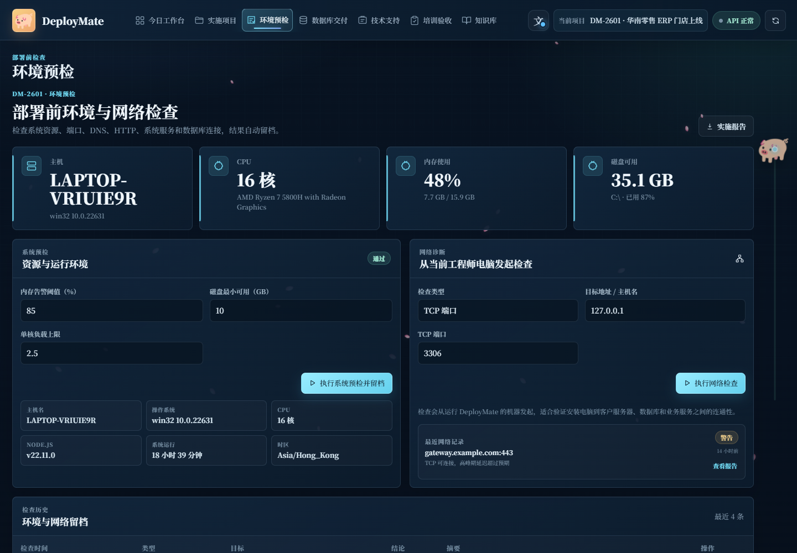
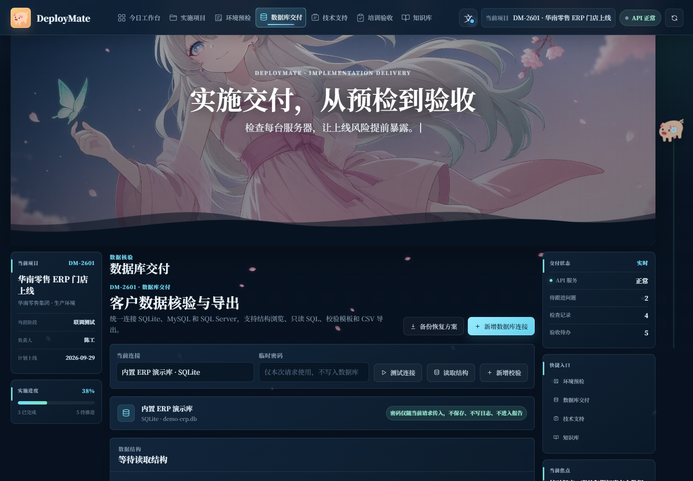
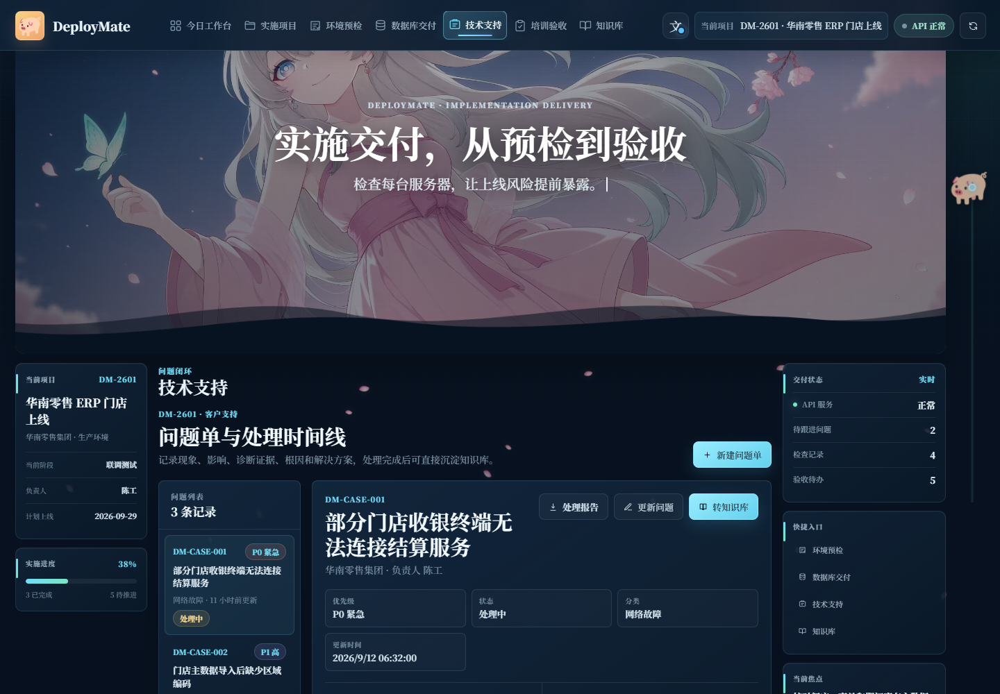
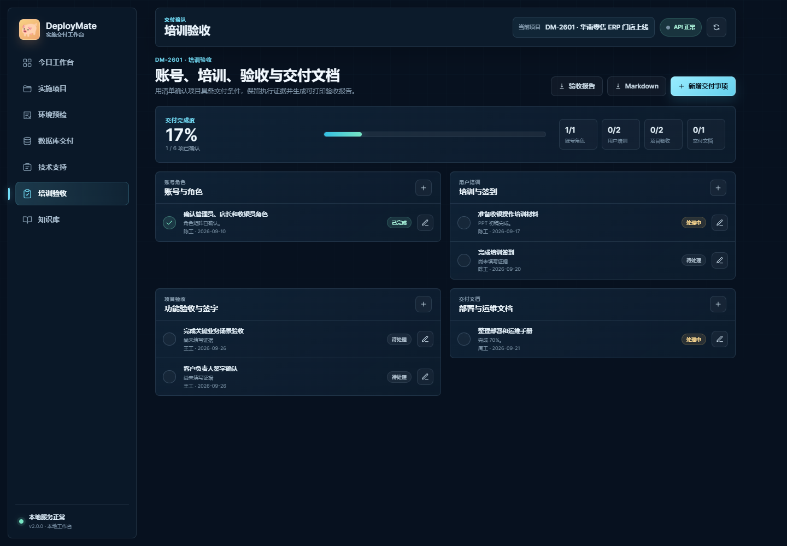
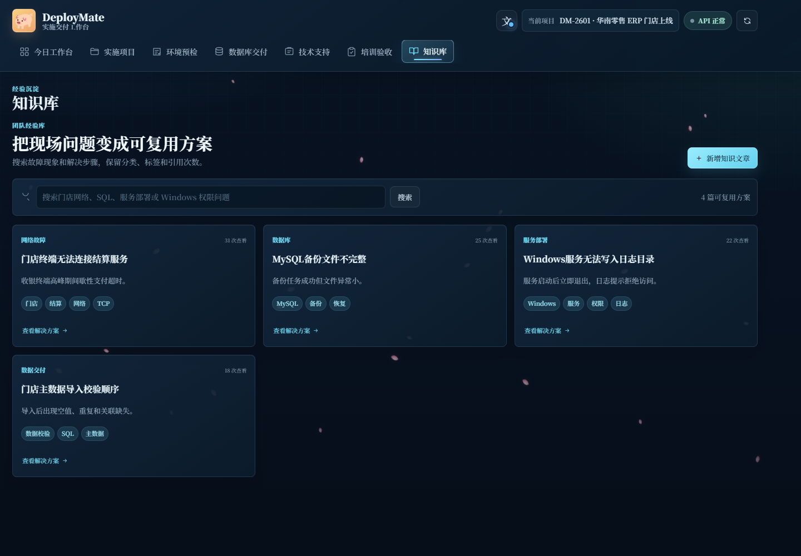
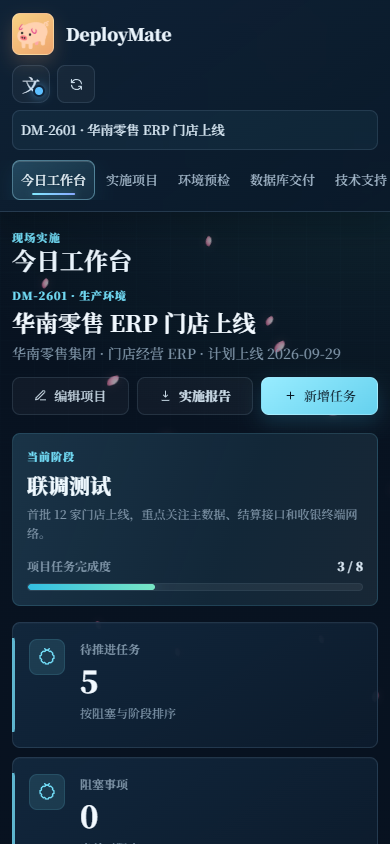
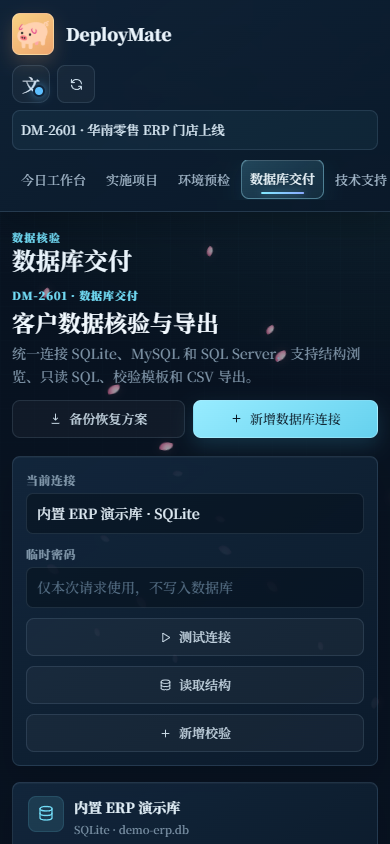

# DeployMate 实施交付工作台

面向软件实施工程师、技术支持工程师和交付工程师的本地工作台。它围绕一次真实的客户项目交付展开，把现场预检、部署核验、数据检查、问题处理、培训验收和知识沉淀放进同一条工作流。



## 产品定位

DeployMate 不是项目经理使用的全局进度看板，而是实施工程师在现场直接使用的交付工具。默认演示项目为“华南零售 ERP 门店上线”，覆盖从需求确认到上线复盘的 8 个标准阶段。

核心目标：

- 用阶段任务和证据记录推进项目，而不是只维护一个百分比。
- 用真实系统、网络和数据库检查生成可留档的现场结论。
- 用问题时间线记录现象、诊断、原因、方案和后续跟进。
- 用培训验收清单、签字记录和交付报告完成项目收口。
- 把已解决的问题转成可复用知识，减少重复排障时间。

## 核心能力

### 今日工作台

只展示当前项目需要关注的内容：下一步任务、阻塞项、最近检查结果、待跟进问题和常用工具。不会出现公司级统计、团队平均完成率或领导视角风险汇总。

### 实施项目

内置标准实施阶段：

`需求确认 → 环境预检 → 安装部署 → 数据核验 → 联调测试 → 用户培训 → 项目验收 → 上线复盘`

每个任务可以维护负责人、计划日期、状态和证据说明，适合在客户现场逐步推进并留下执行记录。

### 环境预检

后端真实检查 Windows/Linux 主机状态，并支持 DNS、TCP、HTTP、Ping、服务端口和应用健康检查。检查结果区分通过、警告和失败，可填写期望值、实际值、结论和整改证据。

### 数据库交付

统一支持 SQLite、MySQL 和 SQL Server：

- 连接测试、版本信息和数据对象读取
- 数据库、表和视图结构浏览
- 只读 SQL 查询与查询结果预览
- 交付前数据校验模板和结果留档
- 备份与恢复命令生成，只生成人工核对的方案，不自动执行高风险恢复
- 当前表或查询结果导出 CSV
- MySQL Docker 演示环境，用于验证非 SQLite 连接流程

SQL 默认只读。需要写操作时必须显式开启；DDL、DROP、TRUNCATE 等高风险语句必须输入确认短语 `CONFIRM DANGEROUS SQL`。

### 技术支持

以问题单为中心，记录客户现象、影响范围、优先级、诊断证据、处理过程、根因、解决方案和后续跟进。每个问题都有独立时间线，已解决的问题可以一键沉淀为知识库文章。

### 培训验收

覆盖账号与角色检查、培训签到、功能确认、验收项、签字记录和遗留问题，并生成可打印的培训验收报告。

### 报告与知识库

交付报告支持 HTML、Markdown 和 CSV。HTML 可直接在浏览器中打印或另存为 PDF。导出前会清理密码、令牌、连接密钥等敏感字段。知识库支持按标题、分类、现象和解决方案搜索。

## 界面预览

| 实施项目 | 环境预检 |
| --- | --- |
|  |  |

| 数据库交付 | 技术支持 |
| --- | --- |
|  |  |

| 培训验收 | 知识库 |
| --- | --- |
|  |  |

移动端布局仅保留核心任务与表单操作：

| 今日工作台 | 数据库交付 |
| --- | --- |
|  |  |

## 快速启动

环境要求：Node.js 22.5 或更高版本。

```bash
git clone https://github.com/linxiaoyuan123/supportops-console.git
cd supportops-console
npm install
npm run dev
```

浏览器打开：

```text
http://127.0.0.1:3100
```

首次启动会自动创建 `data/deploymate.db`、应用表结构和演示数据。默认 SQLite 演示库 `data/demo-erp.db` 也用于“数据库交付”页面。

生产模式：

```bash
npm start
```

## Docker 部署

启动应用：

```bash
docker compose up --build
```

访问 `http://127.0.0.1:3100`。应用数据保存在 Docker Volume `deploymate-data`。

启动可选的 MySQL 8.4 演示库：

```bash
docker compose --profile mysql up -d mysql
```

在“数据库交付”中填写：

| 字段 | 值 |
| --- | --- |
| 类型 | MySQL |
| 地址 | `127.0.0.1` |
| 端口 | `3307` |
| 数据库 | `deploymate_demo` |
| 用户名 | `deploymate` |
| 密码 | `deploymate` |

MySQL 容器首次创建时会自动执行 [`docker/mysql/init/01-demo.sql`](./docker/mysql/init/01-demo.sql)，建立门店、订单、库存和同步日志演示表。

## 常用 API

| 方法 | 路径 | 说明 |
| --- | --- | --- |
| `GET` | `/api/health` | 服务健康状态 |
| `GET` | `/api/workbench` | 当前项目工作台 |
| `GET/POST` | `/api/projects` | 查询或创建实施项目 |
| `GET/PATCH` | `/api/projects/:id` | 项目详情与更新 |
| `GET/POST` | `/api/projects/:id/tasks` | 阶段任务 |
| `PATCH` | `/api/tasks/:id` | 更新任务状态和证据 |
| `GET/POST` | `/api/checks/system` | 系统环境预检 |
| `POST` | `/api/checks/network` | 网络与端口检查 |
| `POST` | `/api/checks/database` | 数据库连接检查并留档 |
| `GET/POST` | `/api/db/profiles` | 数据库连接配置 |
| `POST` | `/api/db/test` | 连接测试 |
| `POST` | `/api/db/schema` | 读取数据库结构 |
| `POST` | `/api/db/query` | 只读 SQL 或受控写操作 |
| `GET/POST` | `/api/db/validations` | 数据校验模板 |
| `POST` | `/api/db/validate` | 执行数据校验 |
| `POST` | `/api/db/backup-plan` | 生成备份或恢复命令并留档 |
| `POST` | `/api/db/export` | 导出 CSV |
| `GET/POST` | `/api/cases` | 问题单 |
| `GET/PATCH` | `/api/cases/:id` | 问题详情与更新 |
| `GET/POST` | `/api/cases/:id/events` | 问题处理时间线 |
| `POST` | `/api/cases/:id/knowledge` | 问题转知识库 |
| `GET/POST` | `/api/handover/:projectId` | 培训验收清单 |
| `PATCH` | `/api/handover/:projectId/:itemId` | 更新验收事项 |
| `GET` | `/api/reports/:type/:id?format=html\|md\|csv` | 生成交付报告 |
| `GET/POST` | `/api/knowledge` | 知识库查询与新增 |

## 数据与安全

核心数据表：

- `projects`、`project_tasks`
- `check_runs`、`check_results`
- `database_profiles`、`data_validations`
- `support_cases`、`case_events`
- `handover_items`
- `knowledge_articles`、`knowledge_links`
- `activities`、`diagnostics`

数据库密码只在当前请求或环境变量中使用，不写入 SQLite、不进入日志、不包含在报告和 CSV 导出中。单条 SQL 只允许一条语句，默认最多返回 200 行。

## 测试与工程化

```bash
npm run check
npm test
```

测试使用 Node.js 内置测试运行器，覆盖：

- 项目任务持久化
- 系统与网络检查
- SQLite 连接、结构、查询和 CSV 导出
- SQL 只读保护与危险语句确认
- 数据校验
- 问题单生命周期、时间线和知识库转换
- 培训验收
- HTML、Markdown、CSV 报告及敏感信息清理

GitHub Actions 会执行语法检查、自动化测试和 Docker 镜像构建。可选安装 Playwright 后，可继续使用本机 Chrome 做桌面端和移动端界面回归。

## 项目结构

```text
.
├── .github/workflows/ci.yml
├── docker/mysql/init/
├── docs/
│   ├── architecture.md
│   ├── usage-guide.md
│   └── screenshots/
├── public/
│   ├── app.js
│   ├── index.html
│   └── styles.css
├── src/
│   ├── app.js
│   ├── database.js
│   ├── diagnostics.js
│   ├── reports.js
│   ├── server.js
│   └── store.js
├── tests/api.test.js
├── Dockerfile
├── docker-compose.yml
└── package.json
```

## 简历表述

> 独立开发实施交付工作台，覆盖环境预检、MySQL/SQL Server 数据核验、问题闭环、培训验收和交付报告生成。

## License

[MIT](./LICENSE)
