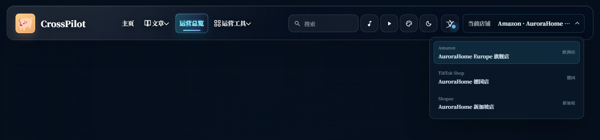
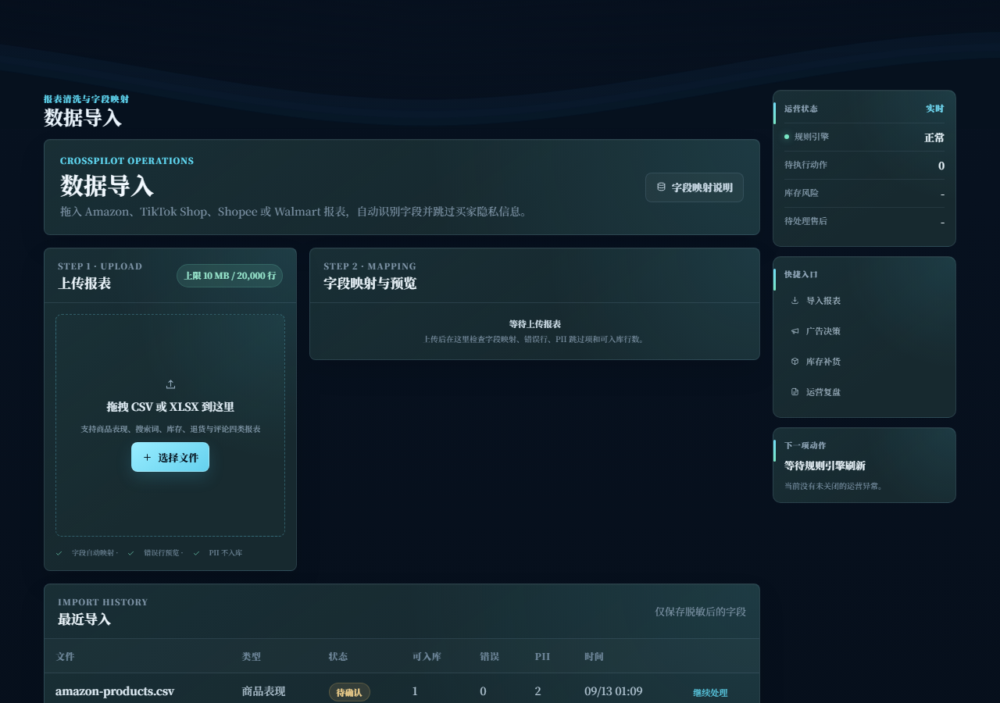
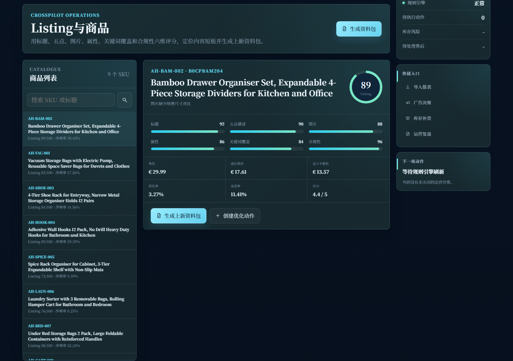

# CrossPilot 跨境电商运营决策中台

面向跨境电商运营岗位的本地决策与执行工作台。项目把报表导入、利润核算、Listing 优化、广告诊断、库存补货、售后处理和周期复盘放进同一条可追踪的运营闭环。

[](https://nodejs.org/)
[](https://pnpm.io/)
[](https://astro.build/)
[](https://www.typescriptlang.org/)


## 项目简介

CrossPilot 不是一个只展示汇总数字的数据看板。它围绕运营人员每天需要回答的问题组织数据和动作：

`报表能不能用 -> 问题在哪里 -> SKU 是否赚钱 -> 下一步做什么 -> 谁负责执行 -> 做完后结果如何`

仓库内置脱敏演示数据，默认案例为 Amazon 欧洲站家居收纳店铺，同时提供 TikTok Shop 和 Shopee 模拟店铺。项目不包含真实平台账号、密钥或买家隐私数据。

## 核心能力

### 数据导入与治理

- 支持 CSV、XLSX 拖拽上传，单文件上限 10 MB、20,000 行。
- 自动识别商品表现、广告搜索词、库存快照、退货与评论报表。
- 支持中英文字段映射、必填字段校验、错误行预览和重复数据处理。
- 买家姓名、邮箱、电话和地址等隐私字段在入库前跳过。
- 导入批次保留映射、校验结果和提交状态，方便追溯。

### 运营分析

- 运营总览：净销售额、净利润率、广告占比、ACOS、TACOS、库存风险、退货率、评分和待处理事项。
- Listing 与商品：标题、五点、图片、属性、关键词覆盖和合规性六维评分。
- 广告与流量：点击、曝光、花费、广告销售、订单、ACOS、ROAS、CVR 和 CPC 诊断。
- 利润与定价：采购成本、平台佣金、履约费、退款损失、广告费和建议售价。
- 库存与履约：可售、在途、预留、残次品、日均销量、覆盖天数、安全库存和建议补货量。
- 售后与账号：退货原因、差评、买家消息、索赔、订单缺陷率、迟发率和取消率。

### 动作闭环与复盘

- 将异常转换为带分类、优先级、负责人、截止时间和推荐来源的运营动作。
- 支持执行证据、延期、重新打开、关闭和完整时间线。
- 日报、周报和月报可导出 HTML、Markdown、CSV 和 XLSX。
- XLSX 报告包含 `Summary`、`SKU`、`Ads`、`Inventory`、`After-sales` 五个工作表。
- 所有建议来自固定指标和可解释规则，不使用生成式 AI 编造经营结论。

### 内容后台

- Astro + Svelte 内容工作区与旧版运营壳共用同一套 API 和 SQLite 数据。
- 支持 Markdown 文章、封面和正文图片、草稿保存、送审、通过、驳回、定时发布和评论审核。
- 支持运营动态、案例项目、证据相册、资源导航和关于页面等结构化内容。
- 文章详情页按原始比例完整显示主封面，列表缩略图保持统一裁切。

## 界面预览

| 店铺切换 | 报表导入 |
| --- | --- |
|  |  |

| Listing 评分 | 内容后台 |
| --- | --- |
|  |  |

## 技术栈

| 层级 | 技术 |
| --- | --- |
| Web 应用 | Astro、Svelte、TypeScript、Tailwind CSS |
| 服务端 | Node.js、原生 HTTP Server、ES Modules |
| 数据存储 | SQLite、better-sqlite3、WAL |
| 数据处理 | ExcelJS、CSV/XLSX 解析、Markdown、sanitize-html |
| 内容编辑器 | CodeMirror、marked、DOMPurify |
| 测试 | Node.js Test Runner、Astro Check、Playwright |
| 部署 | Docker、Docker Compose、Render 配置 |

## 环境要求

| 组件 | 最低要求 | 当前验证版本 |
| --- | ---: | ---: |
| Node.js | `>=24` | `24.19.0` |
| pnpm | `>=11` | `11.19.0` |
| Astro | `7.2.10` | `7.2.10` |
| TypeScript | `6.0.3` | `6.0.3` |
| 操作系统 | Windows、Linux 或 macOS | Windows 验证 |
| 浏览器 | 支持 ES Modules 的现代浏览器 | Chrome、Edge |

## 快速开始

### Windows 一键启动

双击项目根目录的 `start-crosspilot.bat`。脚本会检查运行环境、安装依赖、构建内容站并启动服务，页面可访问后会自动打开浏览器。

### 手动启动

```bash
corepack enable
pnpm install --frozen-lockfile
pnpm run build
pnpm run dev
```

浏览器打开：

```text
http://127.0.0.1:3100
```

首次启动会自动创建：

```text
data/crosspilot.db
data/uploads/
```

生产模式：

```bash
pnpm start
```

## 常用脚本

| 命令 | 说明 |
| --- | --- |
| `pnpm run dev` | 使用 Node.js watch 模式启动服务 |
| `pnpm run build` | 构建 Astro 内容站 |
| `pnpm start` | 启动生产服务 |
| `pnpm test` | 构建内容站并运行全部 Node.js 测试 |
| `pnpm run check` | 检查根服务和旧版前台 JavaScript |
| `pnpm run web:check` | 运行 Astro 类型与组件检查 |
| `pnpm run check:all` | 运行全部静态检查 |
| `pnpm run web:dev` | 仅启动 Astro 开发服务器 |

## 环境变量

| 变量 | 默认值 | 说明 |
| --- | --- | --- |
| `HOST` | `127.0.0.1` | 服务监听地址 |
| `PORT` | `3100` | 服务监听端口 |
| `DB_PATH` | `data/crosspilot.db` | SQLite 数据库路径 |

## 项目结构

```text
.
├── docs/
│   ├── architecture.md
│   └── usage-guide.md
├── public/
│   ├── app.js
│   ├── content-shell.css
│   ├── enhancements.js
│   └── assets/articles/
├── scripts/
│   ├── capture-guide.mjs
│   └── launch.mjs
├── src/
│   ├── app.js
│   ├── content-store.js
│   ├── imports.js
│   ├── markdown.js
│   ├── metrics.js
│   ├── reports.js
│   ├── server.js
│   └── store.js
├── tests/
│   └── api.test.js
├── web/
│   ├── public/assets/articles/
│   ├── src/components/
│   ├── src/layouts/
│   ├── src/lib/
│   └── src/pages/
├── Dockerfile
├── docker-compose.yml
├── pnpm-lock.yaml
├── pnpm-workspace.yaml
└── package.json
```

## 主要 API

| 方法 | 路径 | 说明 |
| --- | --- | --- |
| `GET` | `/api/health` | 服务健康状态 |
| `GET` | `/api/stores` | 店铺、平台和账号健康状态 |
| `GET` | `/api/overview?storeId=1` | 运营总览和异常榜 |
| `GET` | `/api/products?storeId=1` | SKU、利润和 Listing 评分 |
| `GET` | `/api/products/:id/listing-package` | 上新资料包 |
| `GET` | `/api/ads?storeId=1` | 广告搜索词和规则建议 |
| `GET` | `/api/inventory?storeId=1` | 库存风险和补货建议 |
| `GET` | `/api/after-sales?storeId=1` | 售后、SLA 和账号健康 |
| `GET/POST` | `/api/actions` | 查询或创建运营动作 |
| `PATCH` | `/api/actions/:id` | 执行、延期或关闭动作 |
| `POST` | `/api/imports/preview` | 解析 CSV/XLSX 并返回预览 |
| `POST` | `/api/imports/:id/commit` | 确认导入 |
| `GET` | `/api/reports/operations/:storeId` | 导出运营复盘报告 |
| `GET/POST` | `/api/articles` | 文章列表、搜索和新建 |
| `GET/PATCH/DELETE` | `/api/articles/:idOrSlug` | 文章详情、更新和删除 |
| `POST` | `/api/knowledge/:id/review` | 文章审核与发布 |
| `GET/PATCH/DELETE` | `/api/comments/:id` | 评论审核与删除 |
| `POST` | `/api/uploads` | 安全校验并保存图片 |

## 数据与安全

- SQLite 启用 WAL、外键和忙等待，适合本地单用户场景。
- 上传图片限制 5 MB，并校验 MIME、文件头和扩展名。
- 路径解析阻止目录逃逸，媒体清理仅删除未引用文件。
- 响应设置 CSP、`X-Content-Type-Options`、`Referrer-Policy` 和 `X-Frame-Options`。
- 写操作执行同源校验，报告下载使用 `Content-Disposition: attachment`。
- 项目默认不包含登录、云同步和平台 API 凭证，真实部署前需要补充权限与审计。

## 测试与验证

```bash
pnpm run check:all
pnpm test
```

测试覆盖：

- 利润、ACOS、TACOS、ROAS、CVR、退货率和库存覆盖计算。
- Listing 六维评分、广告规则、库存规则和账号健康阈值。
- CSV、XLSX 导入、字段映射、错误行和 PII 跳过。
- 动作闭环、时间线、报告证据和评论审核。
- HTML、Markdown、CSV 和五工作表 XLSX 报告。
- Astro 内容站构建、文章发布状态和图片引用。
- Playwright 多视口布局与文章封面完整显示检查。

## Docker

```bash
docker compose up --build
```

默认数据卷：

```text
crosspilot-data:/app/data
```

数据库路径：

```text
/app/data/crosspilot.db
```

## 文档

- [架构说明](./docs/architecture.md)
- [使用指南](./docs/usage-guide.md)
- [第三方许可](./THIRD_PARTY_NOTICES.md)

## License

[MIT](./LICENSE)
