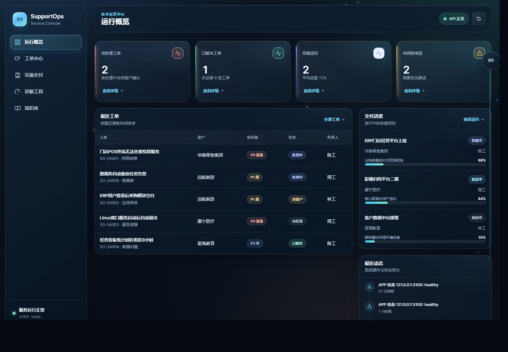

# SupportOps Console

一个面向 **软件实施工程师、技术支持工程师、IT 运维工程师** 的开源工作台。项目将工单闭环、实施交付、数据库管理、网络诊断、知识库和运行状态集中在同一个可部署应用里，适合作为 GitHub 作品集项目展示。



## 项目亮点

- **实施交付看板**：跟踪项目进度、当前实施步骤、负责人、环境和计划完成日期。
- **技术支持工单**：支持筛选、创建、状态流转、负责人分配和解决记录。
- **网络诊断工具**：执行 DNS、TCP 端口、HTTP、Ping 和本应用健康检查。
- **系统状态监控**：查看操作系统、CPU、内存、磁盘、运行时长和 Node.js 版本。
- **解决方案知识库**：沉淀问题现象、处理方案、分类和标签。
- **SQLite 数据持久化**：内置数据库初始化、索引和演示数据，无外部数据库依赖。
- **零第三方运行依赖**：仅使用 Node.js 内置模块和标准化前端。
- **可部署交付**：包含 Dockerfile、Docker Compose、健康检查和 GitHub Actions。

## 快速运行

环境要求：Node.js 22.5 或更高版本。

```bash
npm start
```

浏览器打开：

```text
http://127.0.0.1:3100
```

开发模式会监听文件变化：

```bash
git clone <your-repository-url>
cd supportops-console
npm run dev
```

项目没有 npm 第三方依赖，因此无需先执行 `npm install`。

## Docker 部署

```bash
docker compose up --build
```

打开 `http://127.0.0.1:3100`。SQLite 数据保存在名为 `supportops-data` 的 Docker Volume 中。

也可以直接运行容器：

```bash
docker build -t supportops-console .
docker run --rm -p 3100:3100 -v supportops-data:/app/data supportops-console
```

## 页面说明

| 页面 | 能力 |
| --- | --- |
| 运行概览 | 统计待处理工单、已解决工单、实施项目和风险事项，展示最近动态 |
| 工单中心 | 按关键词、状态和优先级筛选工单，更新状态与解决记录 |
| 实施交付 | 创建实施项目，跟踪部署、联调、培训、验收和上线进度 |
| 诊断工具 | 检查系统资源，执行 DNS、TCP、HTTP、Ping 和应用健康检查 |
| 知识库 | 搜索常见故障方案，新增问题现象、解决步骤和标签 |

## API

| 方法 | 路径 | 说明 |
| --- | --- | --- |
| `GET` | `/api/health` | 服务健康状态 |
| `GET` | `/api/dashboard` | 首页统计数据 |
| `GET` | `/api/tickets` | 查询工单 |
| `POST` | `/api/tickets` | 创建工单 |
| `GET` | `/api/tickets/:id` | 获取工单详情 |
| `PATCH` | `/api/tickets/:id` | 更新工单状态或解决记录 |
| `GET` | `/api/deployments` | 查询实施项目 |
| `POST` | `/api/deployments` | 创建实施项目 |
| `PATCH` | `/api/deployments/:id` | 更新项目进度 |
| `GET` | `/api/knowledge` | 搜索知识库 |
| `POST` | `/api/knowledge` | 新增知识方案 |
| `GET` | `/api/diagnostics/system` | 获取主机和进程状态 |
| `GET` | `/api/diagnostics/history` | 获取诊断历史 |
| `POST` | `/api/diagnostics/network` | 执行网络诊断 |

## 测试与检查

```bash
npm run check
npm test
```

测试使用 Node.js 内置测试运行器，覆盖健康检查、工单流转、实施进度、输入校验和静态页面。

## 项目结构

```text
.
├── .github/workflows/ci.yml
├── docs/
│   ├── architecture.md
│   ├── demo-script.md
│   └── screenshots/
├── public/
│   ├── app.js
│   ├── index.html
│   └── styles.css
├── src/
│   ├── app.js
│   ├── db.js
│   └── server.js
├── tests/api.test.js
├── Dockerfile
├── docker-compose.yml
└── package.json
```

## 数据库设计

项目默认使用 `data/supportops.db`，首次启动时自动建表和写入演示数据。数据表包括：

- `tickets`：客户工单、优先级、处理状态、负责人和解决记录。
- `deployments`：实施项目、部署环境、进度和当前步骤。
- `knowledge_articles`：故障现象、解决方案和标签。
- `activities`：系统操作轨迹。
- `diagnostics`：网络检查历史。

## 面试演示顺序

1. 在运行概览展示工单、交付和风险统计。
2. 新建一张 P1 工单，然后更新状态和解决记录。
3. 在实施交付中把项目从部署中更新到验证中。
4. 在诊断工具执行本应用健康检查，再检查一个 DNS 或 TCP 目标。
5. 展示知识库检索和新增方案。
6. 打开 SQLite 数据文件和 Docker Compose 配置，说明部署与持久化方式。

更完整的两分钟演示稿见 [docs/demo-script.md](./docs/demo-script.md)。

## License

[MIT](./LICENSE)
