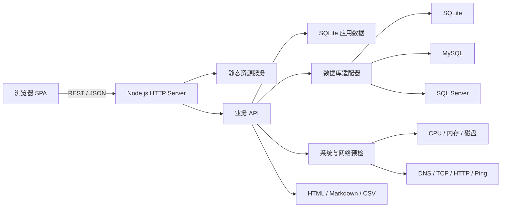

# DeployMate 架构说明

## 总体结构



DeployMate 是单进程本地工作台。`src/server.js` 启动 HTTP 服务，`src/app.js` 同时提供 REST API 和前端静态资源。应用数据使用 `better-sqlite3` 保存在 `data/deploymate.db`，客户数据库通过统一适配器连接。

## 模块职责

| 模块 | 职责 |
| --- | --- |
| `src/app.js` | HTTP 路由、输入校验、静态资源、报告下载 |
| `src/store.js` | SQLite 表结构、迁移、演示数据、业务查询 |
| `src/database.js` | SQLite / MySQL / SQL Server 适配器、SQL 安全、备份恢复方案、CSV |
| `src/diagnostics.js` | 主机、DNS、TCP、HTTP、Ping、服务健康检查 |
| `src/reports.js` | 交付报告生成、格式转换和敏感字段清理 |
| `public/app.js` | 单页前端、页面状态、表单和交互 |
| `public/styles.css` | 响应式控制台界面和固定导航布局 |

## 数据模型

应用数据分为四组：

### 项目与任务

- `projects`：客户、产品、环境、阶段、状态和上线日期。
- `project_tasks`：标准实施阶段下的任务、负责人、计划日期和证据。

### 检查与数据库

- `check_runs`、`check_results`：系统、网络、数据库和备份恢复方案记录。
- `database_profiles`：数据库类型、地址、端口、库名和用户名。密码不落库。
- `data_validations`：交付前 SQL 校验模板、期望值、实际值和结论。
- 备份恢复方案只保存生成状态；命令正文和服务器路径不写入报告。

### 技术支持

- `support_cases`：客户问题、影响、优先级、根因、方案和后续行动。
- `case_events`：问题处理时间线。
- `handover_items`：账号、培训、验收和文档类交付事项。

### 知识与操作记录

- `knowledge_articles`、`knowledge_links`：知识文章及其项目、问题关联。
- `activities`、`diagnostics`：应用操作轨迹和兼容诊断记录。

SQLite 启用外键、WAL 和 5 秒忙等待，适合单用户本地工具的工作方式。

## 数据库适配器

三种数据库共用以下能力：

- `test()`：连接并读取版本。
- `schema()`：读取表、视图和行数。
- `query()`：执行查询并限制返回行数。
- `execute()`：执行受控写操作。
- `close()`：释放连接。

SQLite 使用 `better-sqlite3`，MySQL 使用 `mysql2/promise`，SQL Server 使用 `mssql`。前端连接方式保持一致，后续增加新数据库类型时只需扩展适配器。

## SQL 安全

SQL 会先经过词法检查，再决定执行模式：

1. 默认模式只允许 `SELECT`、`WITH` 和 `EXPLAIN`。
2. 一次只允许一条 SQL，避免批量注入多条语句。
3. 写操作必须显式开启，并由前端二次确认。
4. `ALTER`、`CREATE`、`DROP`、`TRUNCATE` 等高风险语句必须输入 `CONFIRM DANGEROUS SQL`。
5. 查询默认最多返回 200 行，CSV 导出最多 5000 行。

数据库密码只存在请求对象或环境变量中。连接配置写入 SQLite 时会排除密码字段，日志和报告也不会输出密码。

## 诊断实现

系统预检读取操作系统、CPU、内存、磁盘和 Node.js 版本，并允许填写内存上限、磁盘剩余空间和 CPU 负载等期望值。网络预检执行 DNS 解析、TCP 端口连接、HTTP 请求和 Ping，并校验目标格式，避免把任意命令参数直接传给系统命令。

检查结果保存为 `check_runs` 和 `check_results`，能直接用于工作台、问题证据和报告。

## 报告与脱敏

`src/reports.js` 支持 HTML、Markdown 和 CSV。HTML 报告包含内嵌样式，可直接打印或另存为 PDF。生成报告前会递归移除键名包含 `password`、`secret`、`token`、`connectionString` 或 `apiKey` 的字段。

## 部署方式

### 本地

```bash
npm install
npm run dev
```

### Docker

Docker 镜像使用 Node.js 24，先执行 `npm ci --omit=dev` 安装运行依赖，再复制源码。SQLite 文件位于 `/app/data/deploymate.db`，通过 Volume 持久化。

可选的 `mysql` Compose Profile 会启动 MySQL 8.4，并自动执行演示库初始化脚本。SQL Server 保持外部真实实例连接，不额外容器化。

## 测试策略

- API 测试使用临时 SQLite 数据库，不污染本地数据。
- 测试覆盖项目、检查、SQL 安全、数据校验、问题闭环、验收和报告。
- GitHub Actions 执行语法检查、测试和 Docker 构建。
- Playwright 作为开发依赖，用于桌面端和移动端界面回归。
