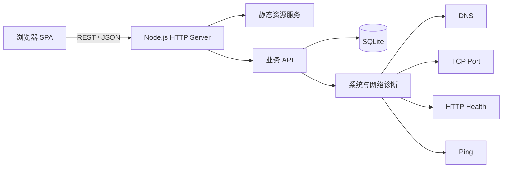

# Architecture

## Design decisions

- **Zero runtime dependencies** keeps clone-and-run simple and gives the reviewer a small, auditable codebase.
- **SQLite** provides real SQL persistence without requiring MySQL or SQL Server to start the demo.
- **Native Node.js diagnostics** show practical troubleshooting concepts such as DNS resolution, TCP connection checks, HTTP status checks, and service health probes.
- **Single HTTP process** serves both the API and the frontend, which keeps local development and Docker deployment straightforward.
- **No build step** means the project can run directly from GitHub with Node.js 22.5 or later.

## Request flow

1. The browser loads `public/index.html`, `public/styles.css`, and `public/app.js`.
2. The frontend calls REST endpoints under `/api`.
3. The HTTP server validates input and delegates persistence operations to `src/db.js`.
4. `src/db.js` performs parameterized SQLite queries and records activity entries.
5. Diagnostic requests run against DNS, TCP, HTTP, Ping, or the application health endpoint and are persisted in `diagnostics`.
