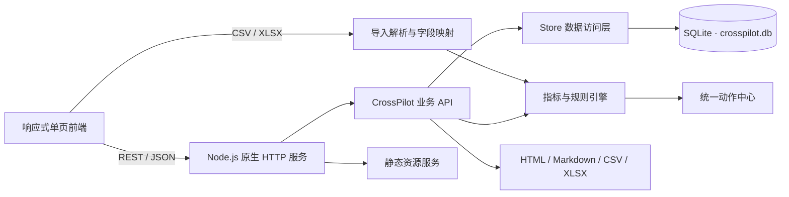

# CrossPilot 架构说明

## 总体结构



CrossPilot 是本地单用户应用。`src/server.js` 启动原生 HTTP 服务，`src/app.js` 提供 REST API 和静态资源服务，业务数据保存在 `data/crosspilot.db`。运行时不依赖外部云服务或平台凭证。

## 模块职责

| 模块 | 职责 |
| --- | --- |
| `src/app.js` | 路由、参数校验、响应头、静态资源、动作闭环和报告下载 |
| `src/store.js` | SQLite 表结构、索引、模拟种子数据、导入和业务查询 |
| `src/imports.js` | CSV/XLSX 解析、多语言字段映射、校验、错误行和 PII 排除 |
| `src/metrics.js` | 利润、ACOS/TACOS、ROAS、CVR、库存、Listing 和账号健康规则 |
| `src/reports.js` | HTML、Markdown、CSV 和五工作表 XLSX 报告生成 |
| `src/server.js` | 进程启动、端口配置和优雅关闭 |
| `public/app.js` | 七模块单页交互、状态同步、动作弹窗和报告操作 |
| `public/crosspilot.css` | 业务模块样式，不替换原有视觉与动画基线 |
| `public/final-shell.css` | Hero、导航、樱花、波浪、卡片和响应式外壳 |


## 数据模型

### 店铺与商品

- `stores`：店铺、平台、市场、币种、费率、履约费、目标 ACOS、目标利润率、采购交期、安全期和数据模式。
- `products`：SKU、ASIN、标题、价格、采购成本、销量、销售额、退款、广告、会话、退货、评分和六维 Listing 分数。
- `daily_metrics`：日销售、订单、广告花费、估算 COGS、会话和退货趋势。

### 投放、库存与售后

- `ad_search_terms`：广告活动、广告组、搜索词、匹配方式、点击、曝光、花费、广告销售和订单。
- `inventory_snapshots`：可售、在途、预留、残次品、日均销量和最近补货日期。
- `after_sales`：差评、退货、买家消息、索赔、订单缺陷、迟发和取消问题，以及负责人、期限和证据。

### 导入、动作与复盘

- `import_batches`：文件、报表类型、状态、行数、PII 列、字段映射和预览。
- `import_rows`：脱敏后的标准行、校验状态和错误信息。
- `actions`、`action_events`：统一动作中心及负责人、优先级、截止时间、证据、结果和事件时间线。
- `knowledge_articles`：运营复盘方法、问题原因和解决方案。
- `activities`：关键操作记录。

SQLite 启用外键、WAL 和忙等待。店铺、商品 SKU 和导入行之间均有明确的归属或外键约束。

## 导入与脱敏流程

1. 前端把 CSV/XLSX 读取为 Base64，并提交文件名、店铺和自动识别类型。
2. 后端检查 10 MB 和 20,000 行限制。
3. `autoMapHeaders` 根据中英文别名匹配标准字段。
4. `validateMappedRows` 处理必填、数字、日期和重复数据校验。
5. PII 字段在进入 `raw` 和 `normalized` 前即被排除，只保留字段名用于界面提示。
6. 用户可调整映射并重新校验，之后确认入库。
7. 入库完成后重新运行规则引擎，生成新的运营动作。

标准字段包括商品、广告、库存和售后四组，平台专有字段可以通过映射接入，不需要改变前端业务模型。

## 指标口径

```text
净利润 = 不含税净销售 - 采购成本 - 平台佣金 - FBA/履约费 - 退款损失 - 广告费
ACOS = 广告花费 / 广告销售
TACOS = 广告花费 / 总销售
ROAS = 广告销售 / 广告花费
转化率 = 订单量 / 会话量
退货率 = 退货数量 / 销量
可售天数 = 可售库存 / 近 30 天日均销量
```

利润由 `src/metrics.js` 的 `deriveProduct` 统一计算，防止总览、SKU 表和报告出现不同口径。

## Listing 评分

默认权重：标题 20%、五点描述 20%、图片 20%、属性 15%、关键词覆盖 15%、合规性 10%。每项先限制在 0 到 100，再按权重汇总为 0 到 100 的总分。

## 规则引擎

规则引擎输出结构化、可解释的动作，不生成自由文本式经营结论。

广告规则：

- 点击至少 15 次且无订单：精确否词候选。
- 花费达到阈值且 ACOS 超过目标的 1.5 倍：降价或暂停。
- 有订单且 ACOS 不高于目标：增加预算候选。

库存规则：

- 覆盖天数低于采购交期加 14 天安全期：缺货风险。
- 覆盖天数高于 90 天：滞销风险。

其他规则：

- 利润率低于 0：利润止损动作。
- Listing 分数低于 75：信息补齐动作。
- 退货率高于 8%：退货复盘动作。
- 店铺评分、订单缺陷率、迟发率或取消率越过阈值：账号健康预警。
- 售后超时或今日到期：高优先级处理动作。

动作使用 `source_type + source_id + recommendation` 生成唯一来源键，重复刷新不会产生重复任务，同时保留用户已经记录的状态、证据和结果。

## 报告

`GET /api/reports/operations/:storeId?format=html|md|csv|xlsx` 生成运营报告。

- HTML：带内嵌样式，可浏览器查看或打印。
- Markdown：适合项目文档和知识库。
- CSV：单文件汇总各模块。
- XLSX：`Summary`、`SKU`、`Ads`、`Inventory`、`After-sales` 五个工作表。

报告从已脱敏数据库读取，并显式标注数据模式和生成时间。

## 安全边界

- 静态文件和 JSON 响应设置 CSP、`X-Content-Type-Options`、`X-Frame-Options`、`Referrer-Policy` 和 `Cache-Control`。
- 导入请求只接受 Base64 文件，后端验证扩展名、大小和行数。
- PII 字段名会被记录，但字段值不进入数据库。
- 报告下载使用附件响应和禁缓存。
- 项目是单用户本地应用，不包含登录、租户隔离、云端密钥和官方平台 API 接入。

## 部署

本地：

```bash
npm install
npm run dev
```

Docker：

```bash
docker compose up --build
```

镜像基于 Node.js 24，数据库位于 `/app/data/crosspilot.db`，通过 `crosspilot-data` Volume 持久化。Render 配置通过 `render.yaml` 管理。

## 测试策略

- Node 内置测试运行器启动临时 SQLite HTTP 服务。
- 固定种子数据验证利润、ACOS、TACOS、ROAS、转化率、退货率、可售天数和 Listing 分数。
- 覆盖 CSV/XLSX 导入、字段映射、错误行、重复数据和 PII 排除。
- 覆盖动作创建、执行、证据回写和规则刷新。
- 覆盖 HTML、Markdown、CSV 和 XLSX 报告内容及工作表名称。
- Playwright 用于 1920、1440、980 和 390 像素视口回归。
